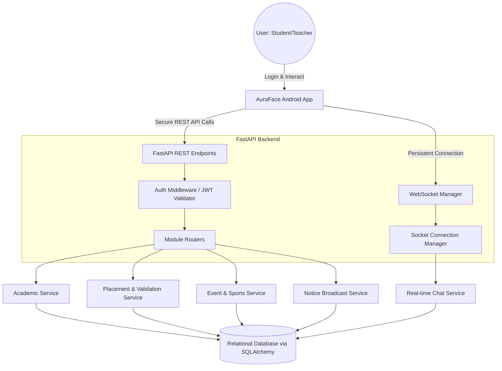
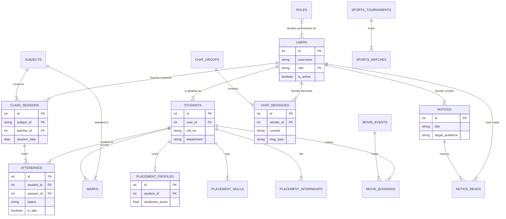

# AuraFace - Complete Project Documentation

## 1. Project Overview & Vision
AuraFace is a comprehensive platform designed to digitize and manage the entire college ecosystem. It unifies scattered academic, administrative, and student-life processes into a single, cohesive system. With a native Android application designed for ease of use and a robust Python backend for high performance, AuraFace caters to Students, Teachers, and Administrators through a fully integrated Role-Based Access Control (RBAC) architecture.

---

## 2. Technology Stack

### Frontend & App
*   **Language**: Kotlin
*   **Framework**: Jetpack Compose (Modern declarative UI toolkit for native Android)
*   **Architecture Pattern**: MVVM (Model-View-ViewModel) for clean separation of concerns and maintainability.
*   **Networking**: 
    *   **Retrofit**: For structured REST API communication.
    *   **WebSockets**: For real-time bi-directional messaging (used in Chat and Notifications).
*   **Dependency Injection**: Hilt / Dagger (Standard for Android).
*   **Local Storage**: Room Database / DataStore (for caching and user preferences).

### Backend Server
*   **Language**: Python 3.10+
*   **Framework**: FastAPI (High-performance, async-first web framework).
*   **Server**: Uvicorn (ASGI web server).
*   **Database ORM**: SQLAlchemy (Object Relational Mapper for handling complex database relationships).
*   **Database Engine**: SQLite / PostgreSQL / MySQL.
*   **Authentication**: JSON Web Tokens (JWT) & OAuth2 Password Bearer.

---

## 3. Core Modules & Their Working

### A. Authentication & User Management (RBAC)
*   **Users & Roles**: Admin, Teacher, and Student roles define the access levels. Permissions dictate what UI elements are shown and what API endpoints can be hit.
*   **Audit Logging**: An `AuditLog` table tracks all critical actions (Login, Create, Update, Delete) with IP tracking for system security.

### B. Academic Management
*   **Classes & Timetables**: `ClassSchedule` handles the structural timetable, while `ClassSession` acts as the daily instance of a class.
*   **Attendance**: Tracks regular, present, absent, and late remarks for students per `ClassSession`. Includes a `CorrectionRequest` workflow allowing teachers to request attendance corrections from admins.
*   **Exams & Marks**: Management of `ExamSchedule` and `Marks` for various assessment types (Midterm, Final).

### C. Communication & Notice Hub
*   **Notices**: Targeted top-down announcements supporting specific audiences (e.g., "All Teachers", or "CSE 3rd Year Students"). Supports rich-text/image attachments, priority levels, and read-receipts (`NoticeRead`).
*   **Chat System / Peer-to-Peer**: Real-time WebSocket-based messaging. Supports file attachments (PDF, Image, Video) with file size tracking. Tracks delivery/read status through `MessageReadStatus`.
*   **Notifications**: Real-time push notifications alerting the Android app of new marks, attendance deficits, system alerts, or messages.

### D. Placements & Careers (Digital Portfolio)
*   Provides a highly structured validation workflow for building out a student's resume.
*   **Components**: Tracks `PlacementSkill`, `PlacementCertification`, `PlacementInternship`, `PlacementProject`, and `PlacementEvent`.
*   **Verification Workflow**: Documents/Skills must be verified by Staff (`approval_status`). Calculates a `readiness_score` based on verified points.

### E. Campus Life & Student Wellbeing
*   **Entertainment - Movies**: Students can book seats to campus movie screenings (`MovieEvent` and `MovieBooking`), featuring waitlist logic and XP cost tracking.
*   **Sports Tournaments**: Track college sports (`SportsTournament`), scheduled matches, and live scores (`SportsMatch`).
*   **Mood Check-ins**: Students track their daily mood (Happy, Focused, Neutral, Tired, Stressed) which can prompt staff interventions.
*   **Proctor Meetings**: 1-on-1 scheduled sessions tracked between Teacher and Student.

### F. File System & Gallery
*   Centralized `GalleryFolder` and `GalleryImage` management to share event photographs and campus memories across the app securely.

---

## 4. System Architecture & Flow Diagram

The Flow Chart maps out how a user requesting an action from the mobile application eventually results in a state change in the Database.

---

## 5. Entity-Relationship (ER) Diagram

The Database schema is composed of several tightly integrated relational networks. Below is an ER Diagram that highlights the most critical entities and how they relate to the core functions of the app.

